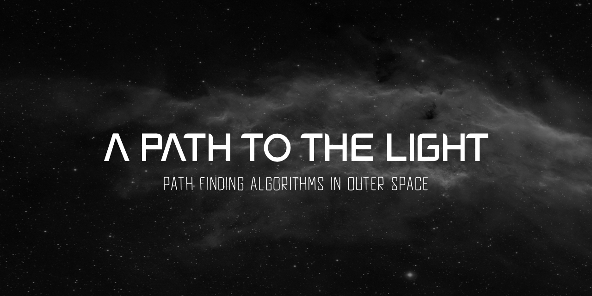

# A Path To The Light
**A Swift PlaygroundBook by Maria Fernanda Azolin submited to WWDC20 Swift Student Challenge, in May 2020.**

## About
"A Path To The Light" is an interactive PlaygroundBook about path finding algorithms.
In case you can't/ do not want to install it, you can see a video preview [here](https://www.youtube.com/watch?v=p7y_d-d1B-0).

## Installation
To enjoy this experience yourself, download the zipped .playgroundbook file in this repository, and open it using Swift Playgrounds 3.3 or above for macOS or iPadOS. 

## Feedbacks
Any feedbacks or comments about this project are welcome! :)
Feel free to contact me on my email (azolin.mf@gmail.com) or  [Instagram](https://www.instagram.com/mfernanda_azolin/)!

